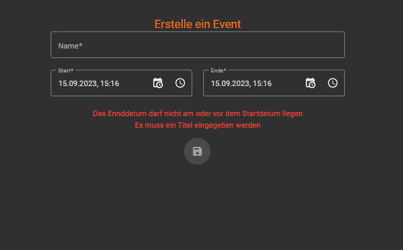

# lobebar
The system in question has been meticulously crafted to cater to the unique needs of smaller cultural venues that rely heavily on volunteer efforts. These venues, often brimming with rich cultural significance, require a streamlined process to manage and allocate various responsibilities, especially when it comes to bar duties and other similar shifts. By implementing this system, such establishments can efficiently distribute shifts among volunteers, ensuring that operations run smoothly. This not only optimizes the manpower available but also ensures that these cultural hubs remain vibrant and active, offering visitors and patrons a seamless experience.

Its possible to add events and to add shifts to those events. Whether this shifts are awareness shifts, bar shifts or cooking shifts is up to the user.

A clear structured caledar allows for the user to gain a fast overview over upcoming events, and whether more help is needed.

One of the standout features of this system is its gamification aspect. Volunteers can track their progress, noting milestones such as how many bar shifts they've completed in a row. This not only adds a fun, competitive edge to the volunteering process but also encourages consistent participation. As volunteers accumulate shifts and reach certain milestones, they earn "snacks" within the system. These "snacks" are essentially perks that can be redeemed at the venue. Whether it's a complimentary drink, a discount on an event ticket, or exclusive access to certain areas, these rewards serve as a token of appreciation for the volunteers' dedication and hard work.

## TODOS
The order of the todos is not the order they should be executed in!

### Backend
- [X] Define database structure
- [X] add controllers
    - [X] add user controller
    - [X] add gamification controller
    - [X] add suply controller
    - [X] add events controller
    - [X] add shifts controller
- [X] add email functions
    - [X] reset password function
- [X] rework controllers so recurring patterns are in base controllers

### Frontend
- [X] add login
- [X] mobile friendly
    - [ ] pwa compatabilities
- [X] add navigation
    - [X] role based rendering
- [X] add forms
    - [X] add event form
    - [X] add user login form
    - [X] add user edit form (same for self and admin edit)
    - [X] add supply form
- [X] add overviews
    - [X] (ADMIN) add user overviews
    - [X] add own shifts overview
        - [X] add upcoming shifts  overview
        - [X] add recent shifts overview
    - [X] add own used supply overview
    - [X] add events overview
        - [X] list with open shifts
        - [X] callendar
    - [X] (ADMIN) add used supplies overview
    - [X] (ADMIN) add booked supplies overview
    - [X] (ADMIN) add supplietypes overview
    - [X] add points and balance overwiew
    - [X] add user-scoreboard overview
- [X] add actions
    - [X] add sign up for shift action
    - [X] add use suply action (maybee balance overview)
- [X] add ngrx state management
    - [X] add state for logged in user
- [X] add services for backend
- [X] add error handling with snackbars
- [X] add achievements and badge and selecting achievements etc. 

